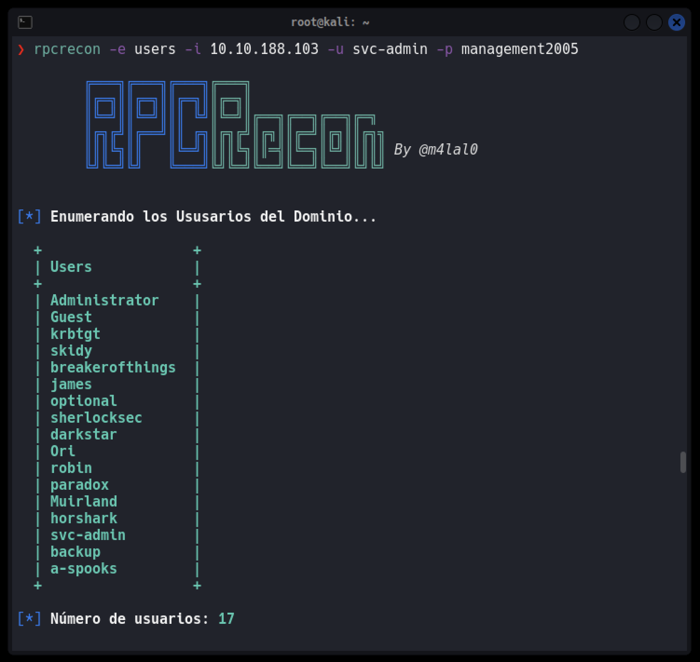
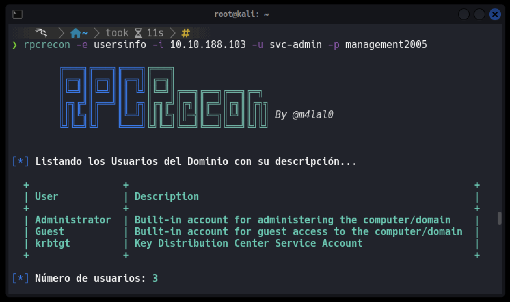
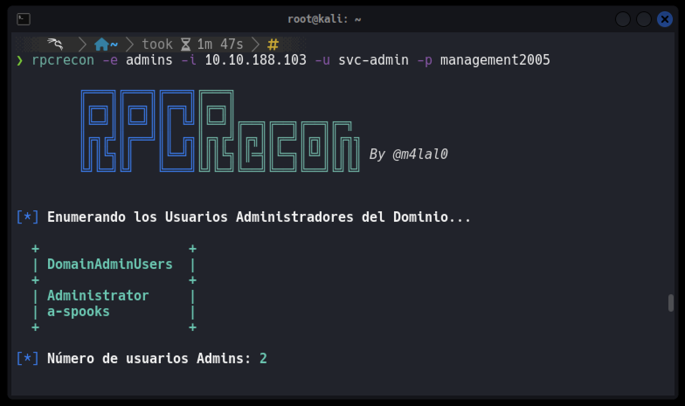
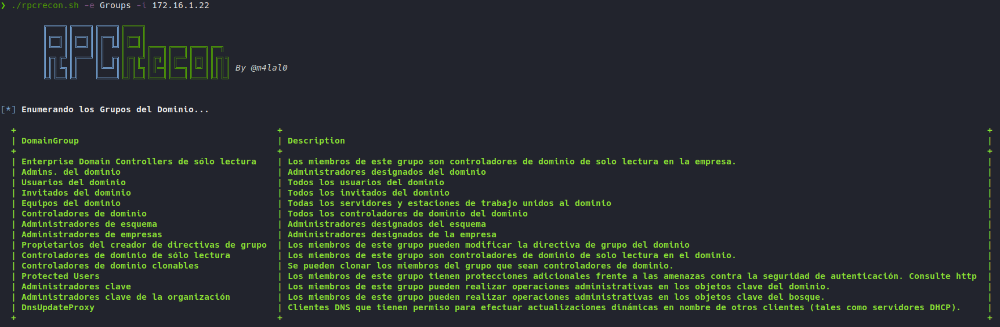
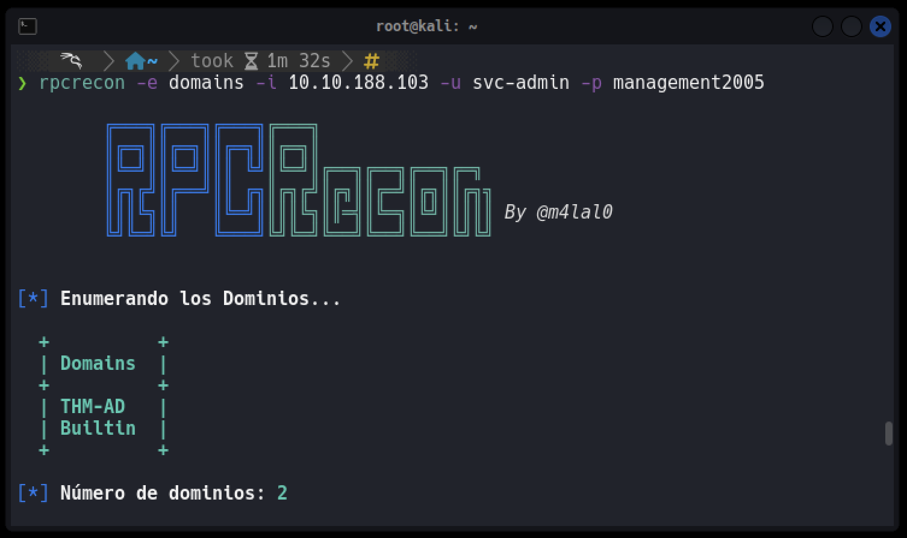
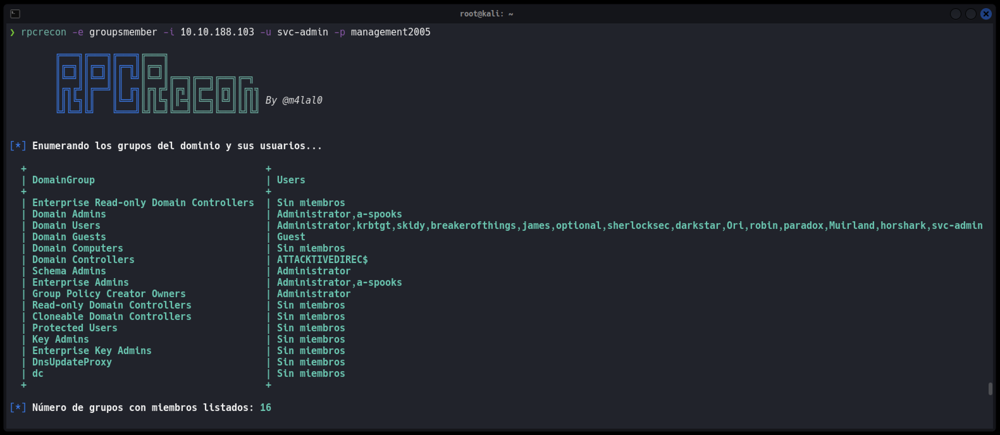
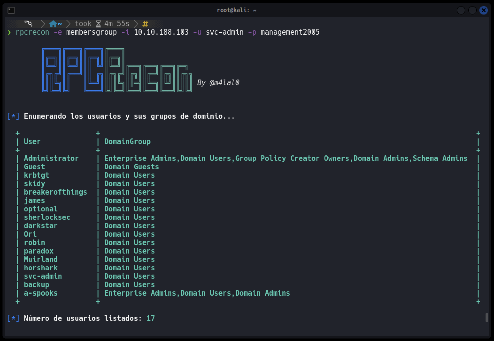

<p align="center"></p>

[](#)
[](#)
[](#)
[](#)
[](#)

# RPCRecon
**RPCRecon** es una herramienta ligera escrita en Bash diseñada para realizar una enumeración básica pero efectiva de un entorno de Active Directory utilizando rpcclient. Su propósito es automatizar la recolección de información clave del dominio, facilitando las fases iniciales de reconocimiento durante auditorías de seguridad o ejercicios de pentesting.

### 🚀 Características principales
RPCRecon permite extraer información crítica del Directorio Activo de forma rápida y organizada, incluyendo:

+ 👥 Enumeración de usuarios del dominio
+ 🗒️ Listado de usuarios del dominio junto a sus descripciones
+ 🔐 Identificación de usuarios administradores del dominio
+ 👪 Enumeración de grupos del dominio
+ 📋 Obtención de grupos del dominio con sus respectivos miembros
+ 🔁 Relación de usuarios y los grupos a los que pertenecen
+ 🌐 Detección de dominios presentes en la red
+ 🎯 Ejecución de un ataque de RID Cycling para identificar posibles usuarios y objetos mediante el rango de RIDs

### ✅ Ventajas
- Sin dependencias complejas: solo necesita ```rpcclient``` y ```Bash```
- Ideal para pruebas rápidas en entornos comprometidos o de reconocimiento inicial
- Organiza la información de forma legible y práctica

# Instalación

```
wget https://raw.githubusercontent.com/m4lal0/RPCrecon/main/rpcrecon.sh
chmod +x rpcrecon.sh && mv rpcrecon.sh /usr/local/bin/rpcrecon
```

# ¿Cómo usar la herramienta?

Al ejecutar la herramienta nos muestra el Panel de Ayuda


```

        ╔═══╗╔═══╗╔═══╗╔═══╗                
        ║╔═╗║║╔═╗║║╔═╗║║╔═╗║                
        ║╚═╝║║╚═╝║║║ ╚╝║╚═╝║╔══╗╔══╗╔══╗╔═╗ 
        ║╔╗╔╝║╔══╝║║ ╔╗║╔╗╔╝║╔╗║║╔═╝║╔╗║║╔╗╗
        ║║║╚╗║║   ║╚═╝║║║║╚╗║║═╣║╚═╗║╚╝║║║║║ By @m4lal0
        ╚╝╚═╝╚╝   ╚═══╝╚╝╚═╝╚══╝╚══╝╚══╝╚╝╚╝


uso: rpcrecon [-h] -e MODE -t TARGET [-u USERNAME] [-p PASSWORD] [-o FORMAT] [-n] [-v] [--update]

Opciones:
  -e, --enumeration  Modo de enumeración: 
                     Users        Listar usuarios del dominio
                     UsersInfo    Usuarios con descripciones
                     Admins       Usuarios administradores
                     Groups       Grupos del dominio
                     GroupsMember Grupos del dominio y sus usuarios
                     MembersGroup Usuarios y sus grupos de dominio
                     Domains      Listar dominios en la red
                     RIDCycling   Enumeración de usuarios mediante RIDs
                     All          Todos los modos
  -t, --target       Dirección IP o nombre del host
  -u, --username     Nombre de usuario (si es requerido)
  -p, --password     Contraseña del usuario (si es requerido)
  -o, --output       Formato de salida {txt, json, grep, html ó all}
  -n, --no-print     No mostrar resultados en pantalla (requiere -o)
  -v, --version      Mostrar la versión instalada
  --update           Actualizar la aplicación
  -h, --help         Mostrar este panel de ayuda

```

Para su ejecución, es necesario especificar el modo de enumeración a usar, mostrados en el panel de ayuda.

El modo de enumeración ***Users***, nos permitirá obtener un listado de los usuarios existentes en el dominio (si no se especifica en los parámetros el Usuario y Password, se efecturará como **Null Session**):



El modo de enumeración ***UsersInfo***, nos permitirá obtener un listado de los usuarios existentes en el dominio con su descripción (si no se especifica en los parámetros el Usuario y Password, se efecturará como **Null Session**), pudiendo así identificar a usuarios potenciales:



El modo de enumeración ***Admins***, nos permitirá obtener un listado de los usuarios administradores existentes del dominio (si no se especifica en los parámetros el Usuario y Password, se efecturará como **Null Session**). Esta parte es crucial, puesto que el atacante siempre va a ir en busca de las credenciales de estos, dado que poseen privilegio total sobre el dominio.



El modo de enumeración ***Groups***, nos permitirá obtener un listado de los grupos existentes del dominio (si no se especifica en los parámetros el Usuario y Password, se efecturará como **Null Session**).



El modo de enumeración ***Domains***, nos permitirá obtener un listado de los Dominios existentes dentro de la red (si no se especifica en los parámetros el Usuario y Password, se efecturará como **Null Session**).



El modo de enumeración ***GroupsMember***, nos permitirá obtener un listado de los grupos existentes del dominio y de los usuarios pertenecientes a cada grupo (si no se especifica en los parámetros el Usuario y Password, se efecturará como **Null Session**).



El modo de enumeración ***MembersGroup***, nos permitirá obtener un listado de los usuarios del dominio y de los grupos a los cuales pertenecen (si no se especifica en los parámetros el Usuario y Password, se efecturará como **Null Session**).



El modo de enumeración ***RIDCycling***, nos permitirá obtener un listado de usuarios a través de RID Cycling Attack (si no se especifica en los parámetros el Usuario y Password, se efecturará como **Null Session**).

Por último, el modo de enumeración ***All***, nos efectuará todas las enumeraciones de forma simultánea, pudiendo así visualizar la información más relevante del dominio.

## Guardar resultados

La herramienta cuenta con la opción de guardar los resultados usando el parámetro **-o** o **--output** y se tiene que dar el formato los cuales pueden ser en ***txt***, ***json***, ***grep*** y ***html*** o si se requiere todos los formatos usar ***all***.

## Actualizar la herramienta

Para poder actualizar la herramienta es necesario ejecutarla con el parámetro **--update**, con ello verifica si existe una nueva versión y si la acepta, se iniciará la actualización completa.

```bash
rpcrecon --update
```