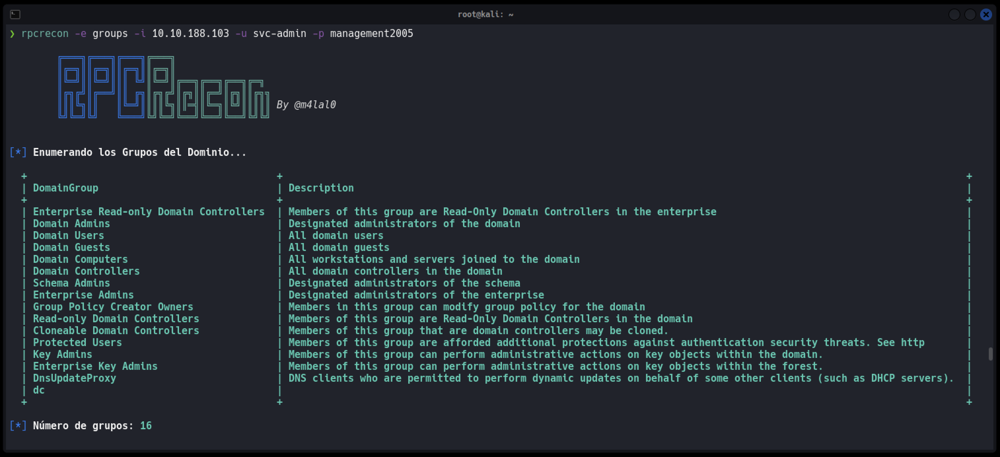

# RPCRecon

[](#)
[](#)
[](#)
[](#)
[](#)


<p align="center">
<b>RPCRecon</b> es una herramienta en Bash para efectuar una enumeración básica y extraer la información más relevante de un Directorio Activo vía rpcclient.
</p>

Esta utilidad nos permitirá obtener la siguiente información de un Dominio:

+ Usuarios del Dominio
+ Usuarios del Dominio con su descripción
+ Usuarios Administradores del Dominio
+ Grupos del Dominio
+ Dominios dentro de la red

## Instalación

```
wget https://raw.githubusercontent.com/m4lal0/RPCrecon/main/rpcrecon.sh
chmod +x rpcrecon.sh && mv rpcrecon.sh /usr/local/bin/rpcrecon
```

## ¿Cómo usar la herramienta?

Al ejecutar la herramienta nos muestra el Panel de Ayuda


Para su ejecución, es necesario especificar el modo de enumeración a usar, mostrados en el panel de ayuda.

El modo de enumeración ***Users***, nos permitirá obtener un listado de los usuarios existentes en el dominio (si no se especifica en los parámetros el Usuario y Password, se efecturará como **Null Session**):


El modo de enumeración ***UsersInfo***, nos permitirá obtener un listado de los usuarios existentes en el dominio con su descripción (si no se especifica en los parámetros el Usuario y Password, se efecturará como **Null Session**), pudiendo así identificar a usuarios potenciales:


El modo de enumeración ***Admins***, nos permitirá obtener un listado de los usuarios administradores existentes del dominio (si no se especifica en los parámetros el Usuario y Password, se efecturará como **Null Session**). Esta parte es crucial, puesto que el atacante siempre va a ir en busca de las credenciales de estos, dado que poseen privilegio total sobre el dominio.


El modo de enumeración ***Groups***, nos permitirá obtener un listado de los grupos existentes del dominio (si no se especifica en los parámetros el Usuario y Password, se efecturará como **Null Session**).



El modo de enumeración ***Domains***, nos permitirá obtener un listado de los Dominios existentes dentro de la red (si no se especifica en los parámetros el Usuario y Password, se efecturará como **Null Session**).


Por último, el modo de enumeración ***All***, nos efectuará todas las enumeraciones de forma simultánea, pudiendo así visualizar la información más relevante del dominio.